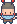
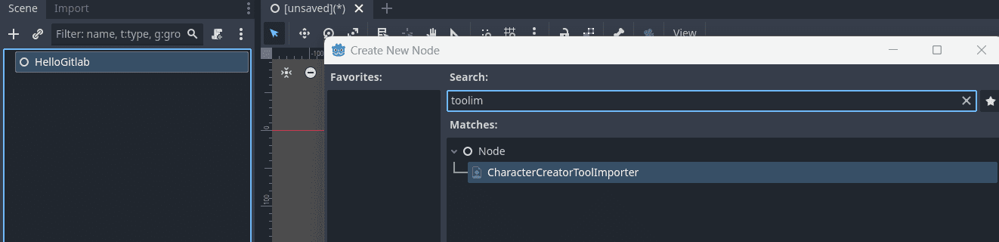
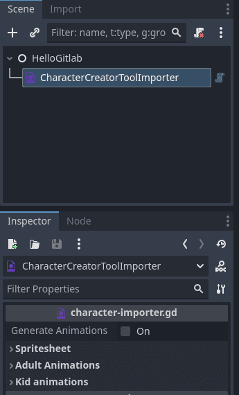
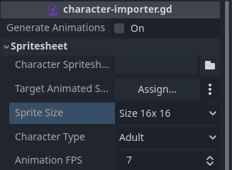
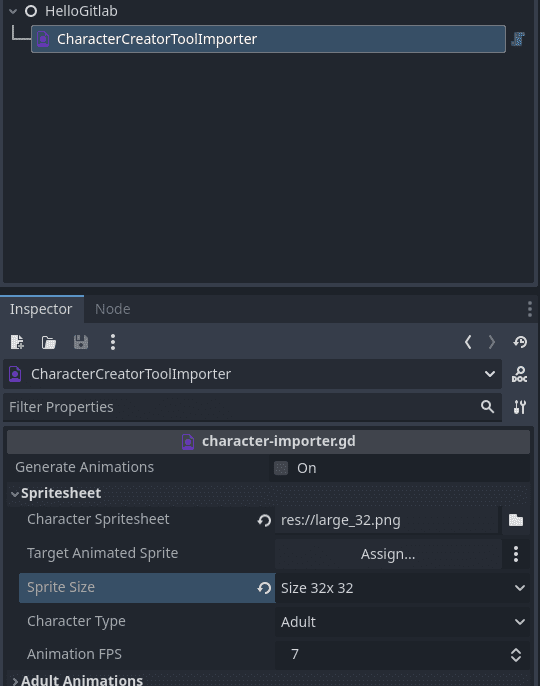
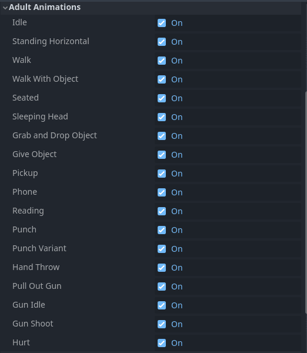
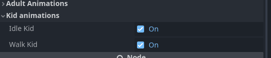
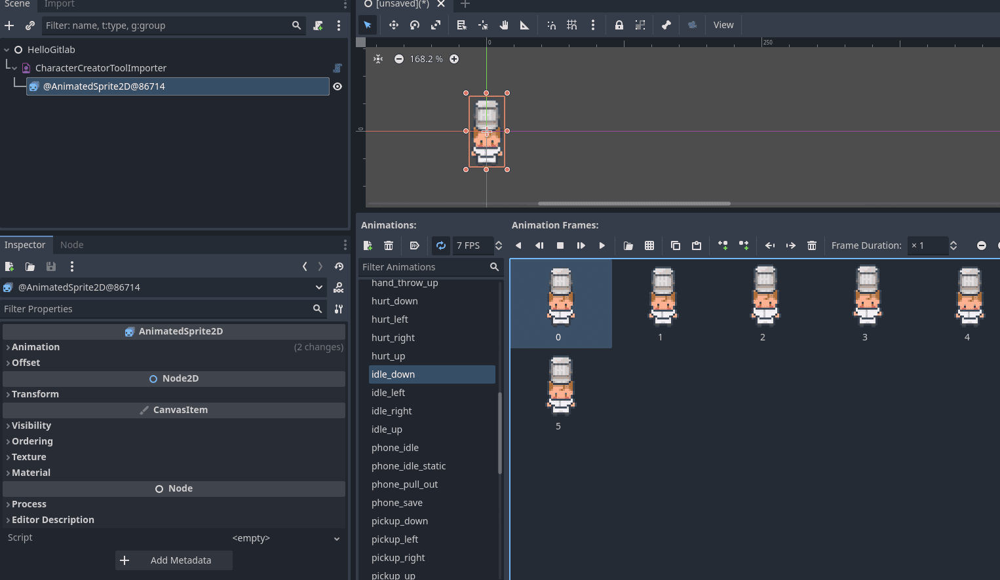

	
	<h1 align="center">Character creator importer tool</h1>

# Getting started
This is **an unofficial tool** that can be used as a plugin in Godot to speed up the process of creating animations for the character generator included in this asset https://limezu.itch.io/moderninteriors.

*There is no examples of spritesheet as it is a paid tool but the process is very simple I promise*

## Features:
- Just one Auxiliar Node that only generates the animations and then can be deleted from the scene tree
- Adult animations
- Kid animations
- Possibility to choose which animations to generate
  

# How to use
The process it couldn't be easier, I summarize it step by step:

## Install and enable the plugin
For further information on the installation process on Godot go to [Installing plugins](https://docs.godotengine.org/en/stable/tutorials/plugins/editor/installing_plugins.html)

### AssetLib
You can find this plugin the AssetLib included in the editor ***(waiting for it to be approved)*** and just install from there.

### Manual
Download this repository and add the content of the **addons** folder into your project plugins folder, by default it's named `addons` but since 4.2 version you can set your custom folder for plugins so be aware of that.

## Generate animations
As you know the tool allows you to save the spritesheet on sizes `16x16`, `32x32`, `48x48`. This is important because you need to select the correct option when import the spritesheet to generate the animations correctly for each size.

You can select a target `AnimatedSprite2D` node that already exists in the scene to output the animations, if no one is provided the plugin create one for you as a child of the `CharacterCreatorToolImporter` node. 

You will see that **there is a checkbox** with the prefix `Generate` serves as a button, if you press it and it does not change don't be mad, it acts as if it were a button and each time it is clicked it generates the relevant animations.

⚠️ *The AnimatedSprite2D you choose will have their existing animations deleted so be careful if you want to keep existing animations.* ⚠️

### Add the node in the scene you want to generate the AnimatedSprite2D

- - -

### Add the spritesheet in .png format and select the correct size and type of character

- - -

### Optionally choose what animations you want to generate from the spritesheet

- - -

### Click on Generate checkbox and enjoy your animated sprite

